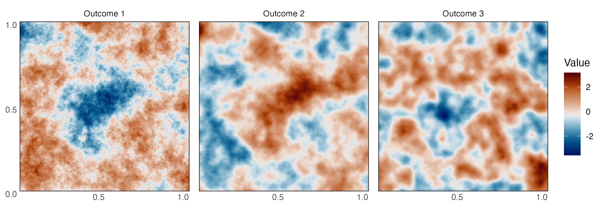
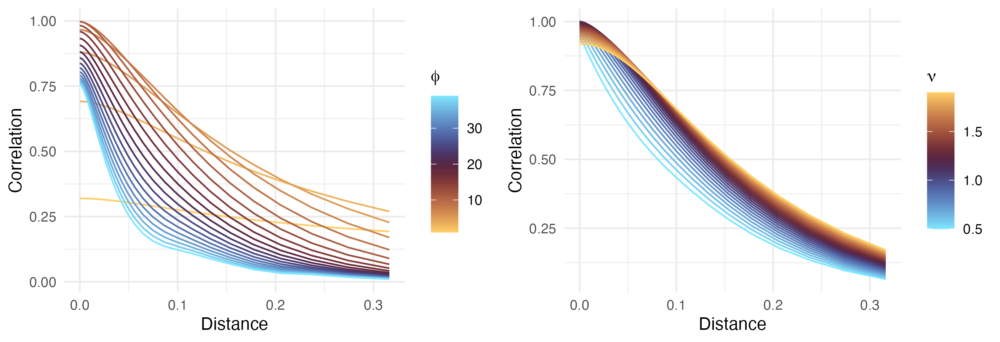

# Inside-Out Cross-covariance for multivariate Gaussian processes

Noise-free trivariate GP using IOX.

Cross-covariance between two variables, for varying spatial range (left) or smoothness (right) of one of them relative to the other.
